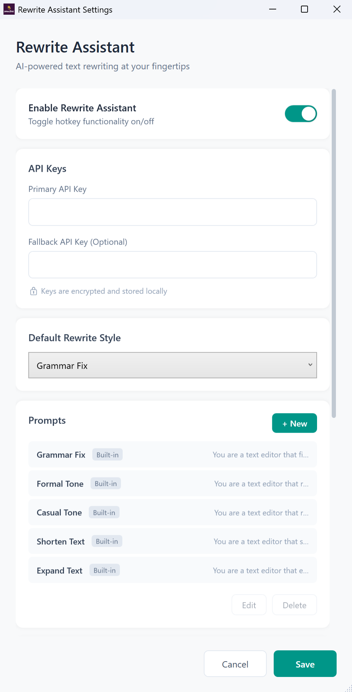
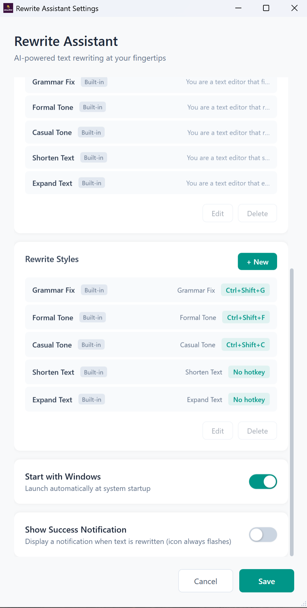

# Rewrite Assistant

A Windows desktop application that helps you rewrite and improve text using AI. Select any text, press a hotkey, and get AI-powered suggestions instantly.

## How It Works


Rewrite Assistant runs quietly in your system tray and integrates seamlessly with any application:

1. **Select text** in any app (email, document, chat, etc.)
2. **Press a hotkey** (e.g., `Ctrl+Shift+G` for grammar fix)
3. **Get rewritten text** instantly—the improved version replaces your original selection

That's it. No copy-paste, no switching windows. Just select, press, and done.

**Default hotkeys:**
- `Ctrl+Shift+G` — Grammar Fix
- `Ctrl+Shift+F` — Formal Tone
- `Ctrl+Shift+C` — Casual Tone

## Features

- **Global Hotkey**: Trigger text rewriting from any application
- **Multiple Styles**: Choose from various rewriting styles (formal, casual, concise, etc.)
- **Custom Prompts**: Create your own rewriting prompts
- **System Tray**: Runs quietly in the background
- **Configurable**: Customize hotkeys and settings to your preference

## Requirements

- Windows 10/11 (64-bit)
- [Cerebras API Key](https://cloud.cerebras.ai/) for AI functionality (1 million tokens free per day)

## Installation

### Option 1: Installer (Recommended)
Download the latest `RewriteAssistantSetup.exe` from the [Releases](../../releases) page and run it.

### Option 2: Build from Source
See [Building from Source](#building-from-source) below.

## Usage

1. Launch Rewrite Assistant (it will appear in your system tray)
2. Right-click the tray icon to access settings
3. Enter your Cerebras API key in the settings
4. Select any text in any application
5. Press a hotkey (e.g., `Ctrl+Shift+G` for grammar fix)
6. The selected text will be rewritten and replaced

## Building from Source

### Prerequisites

- [.NET 6.0 SDK](https://dotnet.microsoft.com/download/dotnet/6.0)
- [Node.js 18+](https://nodejs.org/)
- [Inno Setup](https://jrsoftware.org/isinfo.php) (for creating installer)

### Build Steps

1. **Clone the repository**
   ```bash
   git clone https://github.com/yourusername/rewrite-assistant.git
   cd rewrite-assistant
   ```

2. **Build the backend**
   ```bash
   cd src/backend
   npm install
   npm run build
   ```

3. **Build the WPF application**
   ```bash
   cd src/RewriteAssistant
   dotnet publish -c Release
   ```

4. **Create installer** (optional)
   ```powershell
   ./build-installer.ps1
   ```

## Project Structure

```
├── src/
│   ├── backend/           # Node.js backend (AI integration)
│   ├── RewriteAssistant/  # WPF desktop application
│   └── RewriteAssistant.Tests/  # Unit tests
├── build-installer.ps1    # Build script
├── installer.iss          # Inno Setup script
└── staging/               # Build outputs (gitignored)
```

## Configuration

Configuration is stored in `%APPDATA%\RewriteAssistant\config.json` and includes:
- API key (encrypted)
- Hotkey settings
- Custom styles and prompts

## Screenshots

<p align="center">
  
  
</p>

## License

MIT License - see [LICENSE](LICENSE) for details.
